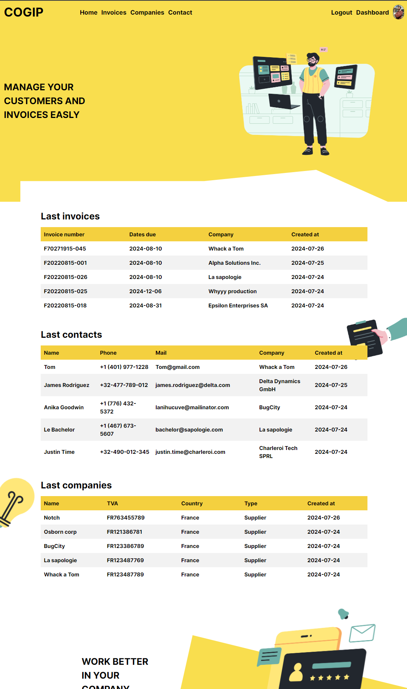
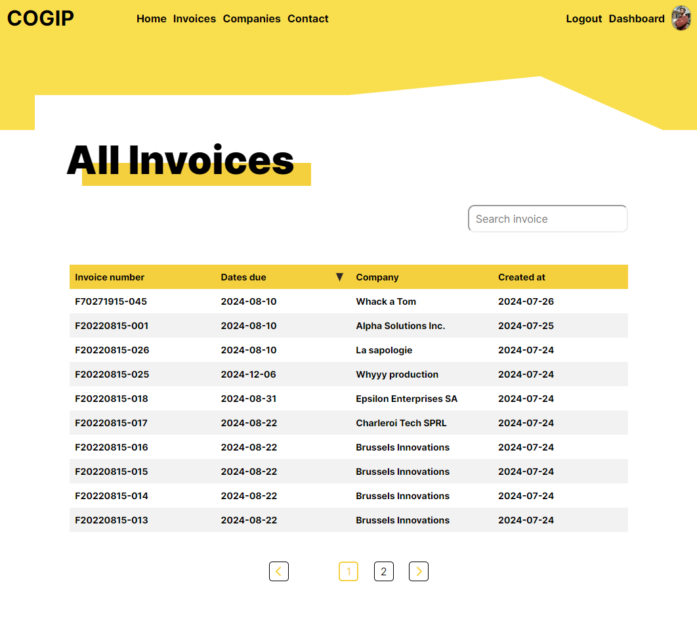
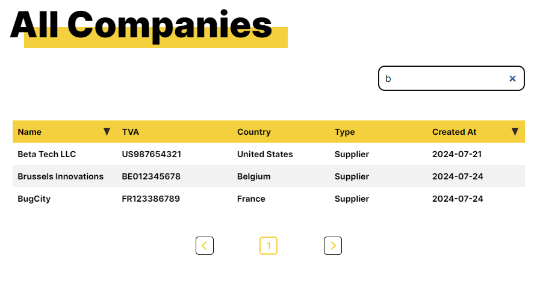
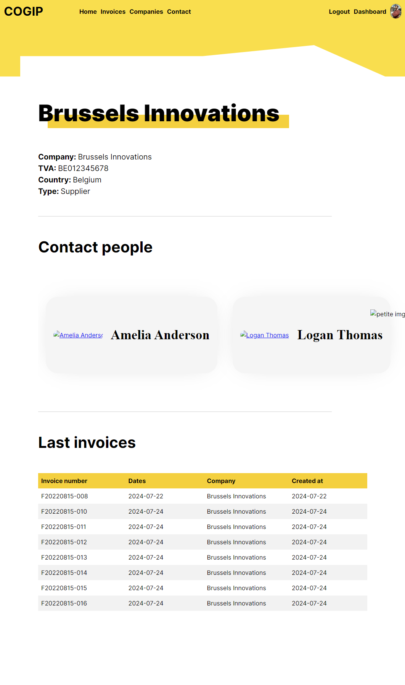
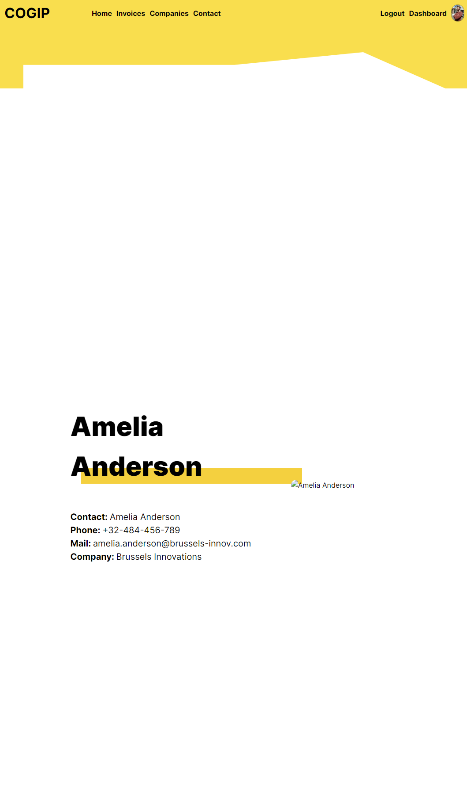
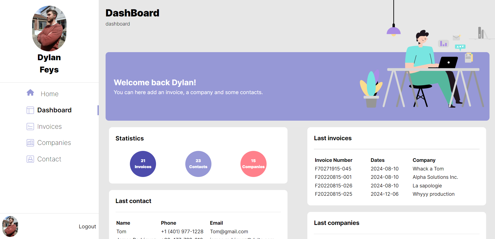
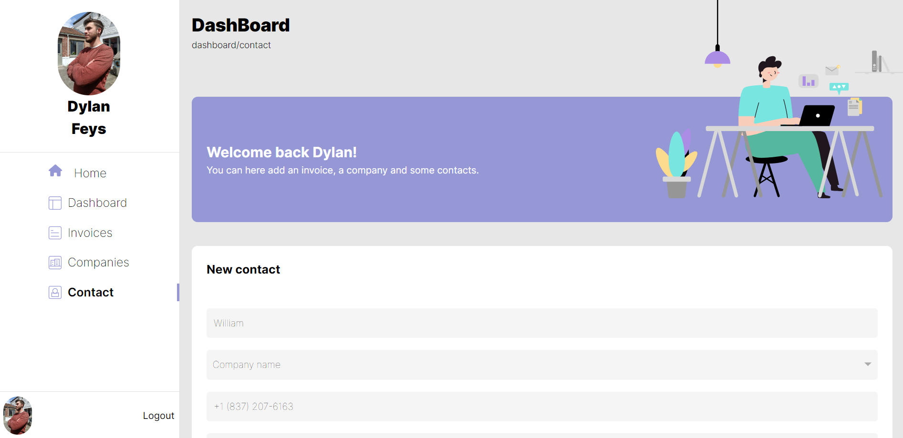

# Cogip - A full stack project

Cogip est un projet full stack réalisé dans le cadre de la formation BeCode. Considéré comme le dernier projet de la formation, il est le plus complet. 

## Table of contents

- [Overview](#overview)
  - [The challenge](#the-challenge)
  - [Screenshot](#screenshot)
  - [Links](#links)
- [My process](#my-process)
  - [Built with](#built-with)
- [Author](#author)

# Overview 

### Le challenge

Back-end
Languages OR technologies Used :

- NodeJs
ou
- PHP 
- POO
- MVC
- Namespace
- Bramus router or your own router
- filp/whoops: (PHP errors for cool kids)

Missions :
En tant que développeurs backend, votre mission est de créer une API relative à cette mission.

Front-end
Languages OR technologies Used :

- React (mandatory) using vite
- SASS or a CSS framework

Missions :
- Respecter la maquette suivante : https://tinyurl.com/659sb7bb
- Mobile First
- Validation côté client
- Utilisation de npm (tailwind ou vos préférences)
- Test Google Ligthouse
- Sémantique

### Screenshot 

## My Process

### Built with

En équipe de 2 fronts, nous avons réalisé ce projet avec :

- Semantic HTML5 markup
- SCSS
- React
- React Router Dom
- Flexbox
- Mobile-first workflow

## Author

