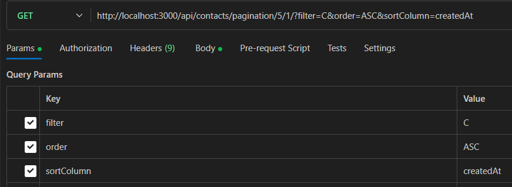

# API Documentation

## Overview

This documentation provides details about the API endpoints, including parameters and response formats.

---

## Endpoints

Ensure to always use `http://localhost:3000/api` as the root endpoint for any kind of request!

### Users

| Endpoint                | Method | Body                                                                          | Description                                                   |
|-------------------------|--------|-------------------------------------------------------------------------------|---------------------------------------------------------------|
| `/users`                | GET    | None                                                                          | Returns the list of all users                                 |
| `/users/:id`            | GET    | None                                                                          | Returns user details for the given ID                         |
| `/users`                | POST   | `firstName` (str), `lastName` (str), `email` (str), `password` (str)          | Creates a new user in the DB, then returns the user in response |
| `/users/login`          | POST   | `email` (str), `password` (str)                                               | Attempts to log in user, if attempt successful, returns user as object |

### Contacts

| Endpoint                                  | Method | Body                                                                | Description                                                                                                 |
|-------------------------------------------|--------|---------------------------------------------------------------------|-------------------------------------------------------------------------------------------------------------|
| `/contacts`                               | GET    | None                                                                | Returns the list of all contacts in alphabetical order                                                      |
| `/contacts/pagination/:nbPerPage/:page?`  | GET    | None                                                                | Returns paginated contacts. See below for query parameters.                                                 |
| `/contacts/latest`                        | GET    | None                                                                | Returns the 5 last added contacts                                                                           |
| `/contacts/:id`                           | GET    | None                                                                | Returns contact details for the given ID                                                                    |
| `/contacts/company/:companyId`            | GET    | None                                                                | Returns list of contacts for the companyId given in URL                                                     |
| `/contacts`                               | POST   | `name` (str), `companyId` (str), `email` (str), `phoneNr` (str)     | Creates a new contact in the DB, then returns the contact in response                                       |
| `/contacts/:id`                           | PATCH  | `name` (str), `email` (str), `phoneNr` (str)                        | Edit contact details for the given contact ID                                                               |
| `/contacts/:id`                           | DELETE | None                                                                | Delete contact entry with matching id                                                                       |

#### `/contacts/pagination/:nbPerPage/:page?` Query Parameters

- `nbPerPage` (int): Number of results to display per page.
- `page` (int): Page number to display (default is 1 if not specified).
- `sortColumn` (str) [optional]: The column to sort the results by (`name` OR `createdAt`).
- `order` (str) [optional]: The order of sorting for sortColumn (`ASC` for ascending, `DESC` for descending).
- `filter` (str) [optional]: A filter string to limit results to contacts that match the filter criteria (name).

Example : 

### Images

| Endpoint                       | Method | Body           | Description                                           |
|--------------------------------|--------|----------------|-------------------------------------------------------|
| `/images/users/:userId`        | PATCH  | `image` (file) | Updates the image for the user with matching id       |
| `/images/contacts/:contactId`  | PATCH  | `image` (file) | Updates the image for the contact with matching id    |

### Invoices

| Endpoint                                            | Method | Body                                                                    | Description                                                                                   |
|-----------------------------------------------------|--------|-------------------------------------------------------------------------|-----------------------------------------------------------------------------------------------|
| `/invoices`                                         | GET    | None                                                                    | Returns a list of all the invoices sorted by newest to oldest                                 |
| `/invoices/latest`                                  | GET    | None                                                                    | Returns the list of the 5 latest invoices                                                     |
| `/invoices/:id`                                     | GET    | None                                                                    | Returns the details of the invoice matching the ID given as param                             |
| `/invoices/company/:companyId`                      | GET    | None                                                                    | Returns the list of invoices for the company matching company ID sent in URL                  |
| `/invoices/pagination/:nbPerPage/:page?` | GET    | None                                                                    | Returns paginated invoices. See below for query parameters.                                   |
| `/invoices`                                         | POST   | `companyId` (str), `reference` (str), `dueDate` (str YYYY-MM-DD)        | Creates a new invoice in the DB, and returns the invoice details in response                  |
| `/invoices/:id`                                     | DELETE | None                                                                    | Deletes the invoice matching the id sent in URL                                               |

#### `/invoices/pagination/:nbPerPage/:page?` Query Parameters

- `nbPerPage` (int): Number of results to display per page.
- `page` (int): Page number to display (default is 1 if not specified).
- `order` (str) [optional]: The order of sorting by dueDate (`ASC` for ascending, `DESC` for descending).
- `filter` (str) [optional]: A filter string to limit results to invoices with matching company name.

### Companies

| Endpoint                | Method | Body                                             | Description                        |
|-------------------------|--------|--------------------------------------------------|------------------------------------|
| `/companies`            | GET    | None                                             | Returns all companies              |
| `/companies/:id`        | GET    | None                                             | Returns company details by ID      |
| `/companies`            | POST   | `name` (str), `country` (str), `vat` (str)       | Creates a new company              |
| `/companies`            | PATCH  | `name` (str)                                     | Updates company details by ID      |
| `/companies/:identifier`| DELETE | None                                             | Deletes company by ID or name      |
| `/companies/pagination/:nbPerPage/:page?` | GET    | None                                                                    | Returns paginated companies. See below for query parameters.                                   |

#### `/companies/pagination/:nbPerPage/:page?` Query Parameters

- `nbPerPage` (int): Number of results to display per page.
- `page` (int): Page number to display (default is 1 if not specified).
- `sortColumn` (str) [optional]: The column to sort the results by (`name` OR `createdAt`).
- `order` (str) [optional]: The order of sorting by dueDate (`ASC` for ascending, `DESC` for descending).
- `filter` (str) [optional]: A filter string to limit results to invoices with matching company name.

### Statistics

| Endpoint                | Method | Body  | Description                                                   |
|-------------------------|--------|-------|---------------------------------------------------------------|
| `/stats`                | GET    | None  | Returns the total number of existing invoices, contacts, and companies |

---

## Error Handling

### Common Errors

| Status Code               | Description                                                           | Response                                                          |
|---------------------------|-----------------------------------------------------------------------|-------------------------------------------------------------------|
| 400 Bad Request           | The server could not understand the request due to invalid syntax.    | `json { "status": "error", "message": "Bad Request" }`            |
| 404 Not Found             | The server can not find the requested resource.                       | `json { "status": "error", "message": "Not Found" }`              |
| 500 Internal Server Error | The server has encountered a situation it doesn't know how to handle. | `json { "status": "error", "message": "Internal Server Error" }`  |
